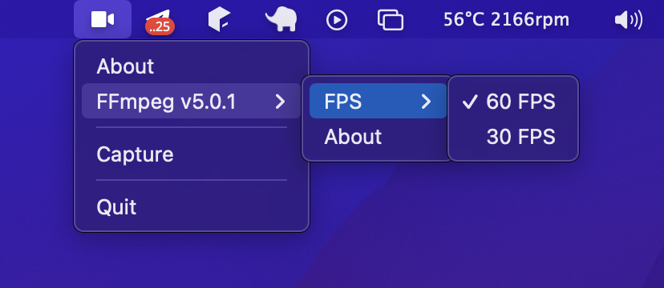

# go-capture

[](https://www.buymeacoffee.com/dmvsk)

Example of desktop video capture using ffmpeg with GOLang.



## Install

```
git clone git@github.com:black40x/go-capture.git
cd go-capture
go get
```

After it install https://ffmpeg.org

## Build

### MacOS from MacOS
```
go build -o build/capture main.go 
```

### Windows
```
go build -ldflags -H=windowsgui -o build/capture.exe main.go  
```

### Linux
```
Will be later... 🤷🏻
```  